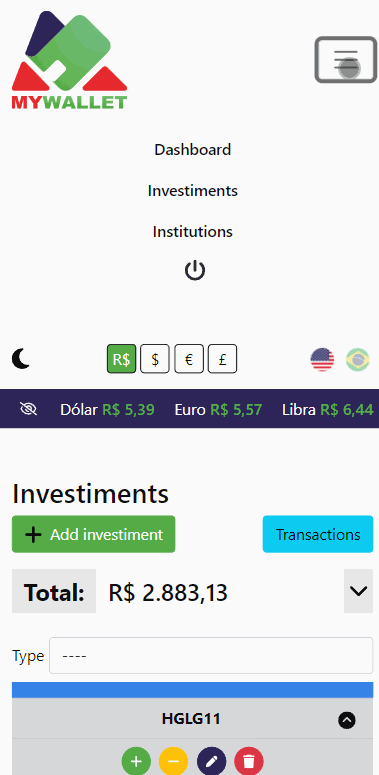

# Finance
Investments portfolio in Django, which JavaScript in the front end;
Made for CS50'S course conclusion [Web Programming with Python and JavaScript](https://cs50.harvard.edu/web/2020/)

## Project description
Designed to organize the purchases and sales of investments in a portfolio, showing a lot of wallet results. It is not recommended for DAY TRADER, it will be better used for BUY AND HOLDER.

The project will allow for:
- [X] Create investment types and organize them into types and portfolio weights
- [X] Create brokers to associate the actions
- [X] Register "BUY" and "SELL" investments
- [X] Register new transactions for your investments
- [X] The investment table can be filtered by investiment type
- [X] The investments table will show:
  - [X] Real-time investment quotes
  - [X] Current amount in the portfolio, in green for buy positions and in red for sell positions
  - [X] The amount paid on the acquisition of the investment
  - [X] The current value of the investment in the portfolio
  - [X] The updated profit in % 
  - [X] The weight in % of each investment in the portfolio, and how much was planned
  - [X] How much is left to buy what was planned for the stock
  - [X] The related broker
  - [X] If the position is zeroed, the line will turn into gray and it will show the realized profit in value and percentage
- [X] The transaction's table can be filtered by investment
- [X] Create goals and measure how much is left to reach your ideal equity

And more:
Many updates are done directly with AJAX;
Responsive of course;
Availability in English and Brazilian Portuguese;
Multicurrencies: the user will be able to see his total equity in currencies [USD, BRL, EUR, GBP] in addition to checking the updated exchange rate;
Dark theme;

## Descrição do projeto
Projeto para organizar as compras e vendas de investimentos em um portfólio mostrando diversos resultados da carteira. Não é recomendado para DAY TRADER, será melhor usado para a técnica BUY AND HOLDER.

O projeto permitirá:
- [X] Criar tipos de investimentos e organizar suas ações em setores e pesos na carteira
- [X] Criar corretoras para associar as ações
- [X] Cadastrar investimentos dos tipos de "COMPRA" e "VENDA"
- [X] Cadastar novas transações para seus investimentos
- [X] A tabela de investimentos poderá ser filtrada por tipo
- [X] A tabela de investimentos mostrará:
  - [X] A cotação dos investimentos em tempo real
  - [X] A quantidade atual na carteira, em verde para posições de compra e em vermelho para venda
  - [X] O valor pago na aquisição do investimento
  - [X] O valor atual do investimento na carteira
  - [X] O lucro em % atualizado
  - [X] O peso em % de cada investimento na carteira, e o quanto foi planejado
  - [X] Qunato falta para se comprar da ação de acordo com o planejado
  - [X] A instituição relacionada  
  - [X] Caso a posição esteja zerada, a linha ficará cinza e mostrará o lucro realizado em valor e em porcentagem
- [X] A tabela de transações poderá ser filtrada por investimento
- [X] Criar metas e mensurar o quanto falta para alcançar seu patrimônio ideal

E mais: 
Muitas atualizações são feitas diretamente com AJAX;
Comportamento responsivo;
Disponibilidade nos idiomas Inglês e Português do Brasil;
Multi moedas: o usuário poderá ver seu patrimônio total nas moesas [USD, BRL, EUR, GBP] além de conferir o câmbio atualizado;
Tema escuro;

## Why Finance?
I've made this project to replace an excel with the same calculations and GOOGLEFINANCE API. The problem was feed the data and manage the columns manually, it wouldn't be clear for a layman to modify it. In addition, the file not restricting access by accounts.

## Por quê Finance?
Crei o projeot para substituir um excel com os extatos cáclulos e que usava a API do GOOGLEFINANCE. O problema era alimentar os dados e administrar as colunas manualmente, não ficaria claro para alguém leigo modificá-lo. Além de não restringir acesso por contas.

## Distinctiveness and Complexity
The biggest differentials of my project are:
Being able to organize investments with classification notes and types;
Estimate the portfolio percentage and how much is left to match it;
Calculations for both buy and sell asset positions.

The challenges were:
Match the same returns in python and javascript functions;
Create dozens of calculations to define the stock's final position, estimate profit, manage the weight of the stock in the portfolio even with currencies at different quotations;
Add up the value of the investments, disregarding the BUY/SELL balance of each share, and segment  sums by investment's types;

## Destinção e Complexidade
Os maiores diferenciais do meu projeto são:
Poder organizar os investimentos em notas de classificação e tipos;
Estimar a % na carteira e quanto falta para correspondê-la;
Os cálculos funcionam tanto para posições de compra quanto para venda de ativos.

Os desafios foram: 
Corresponder os mesmos retornos nas funções de python e javascript;
Criar dezenas de cálculos para definir a posição final da ação, estimar lucro, administrar o peso da ação na carteira mesmo com moedas em cotações diferentes;
Somar o valor dos investimentos já desconsiderando o balanço de COMPRA/VENDA de cada ação, e segmentar essa soma por tipo de investimento;

## Dashboard
Dashboard shows the portfolio total, how much has been invested and the overall profit. Also goals and the graph of the % of each type of investment under equity.

O Dashboard mostra o total do portfólio, o quanto foi investito, e o lucro geral. Além das metas e o gráfico da % de cada tipo de investimento sob o patrimônio.

### Screenshots





## Dark mode


## Files Description 
- [X] balance.py - Use Invesiment and Transaction model to calculate total (gerneral, by type and invested) and profit. Use this file in all pages besides investiments view ( this page already has its own calculation
 )
- [X] forms.py - All forms and fields validation functions
- [X] models.py - 7 Models (User, UserPreferences, Type, Institution, Investiment, Transaction, Goal)
  - [X] User - Who's register / login
  - [X] UserPreferences - An separate table to record user theme and currency
  - [X] Type - Organize investments by categories
  - [X] Institution - Associate investments with brokers 
  - [X] Investiment - Record investments
  - [X] Transaction  - Record all transactions
  - [X] Goal - User's could create goals to achieve
- [X] signals.py - Create user preferences with user account
- [X] tests.py - Make sure the basic run's successful
- [X] url.py - Front-end routes
- [X] util.py - Functions for:
  - [X] Connect with yfinance and get investments prices
  - [X] Monetary conversor
- [X] views.py
  - [X] index - Redirect to Index page or Dashboard for logged users
  - [X] getPrices - Return prices with Json
  - [X] investiments - Get and Post for investiments
  - [X] investiment - Update and delete investiment
  - [X] transactions - Get and Post for transactions
  - [X] transaction - Update and delete transaction
  - [X] institutions - Get and Post for brokers
  - [X] institution - Update and delete broker
  - [X] create_type - Post investiment type
  - [X] type - Update and delete type
  - [X] create_goal - Post goal
  - [X] goal - Update and delete goal
  - [X] setCurrency / setTheme - Save use's preferences
  - [X] login_view - Get and Post for login
  - [X] logout_view - Post for logout
  - [X] register -Get and Post for register
- [X] templatetags / filter.py - Some masks and calculations used in the loops
- [X] templates / finance / *.html - All the HTML render
- [X] static * - Styles files and Javascript
  - [X] js / chart - Charts library
  - [X] js / main -  Most of ajax/api functions, cookies and conversors
  - [X] js / dashboard - Specifc institution page dashboard
  - [X] js / intitution - Specifc institution page javascript
  - [X] js / investiments - Specifc investiments page javascript
  - [X] js / transactions - Specifc transactions page javascript

## Installation
You will need [Python](https://www.python.org/) with [Django library](https://www.djangoproject.com/)  
```
• Clone the package 
• pip install -r requirements.txt 
• python manage.py collectstatic
• python manage.py makemigrations
• python manage.py migrate  
• python manage.py test  
• python manage.py runserver  
```

## Make Sass
sass --watch finance/static/scss:finance/static/css --style compressed

## Bug Reports and Improvements
If you experience any bugs or see anything that can be improved or added, please feel free to [open an issue](https://github.com/carlosjosedesign/finance/issues) here or simply contact me through any of the methods below. Thanks in advance!

Email: carlosjosedesign@gmail.com <br/>
Linkedin: https://www.linkedin.com/in/carlos-jose-design/


